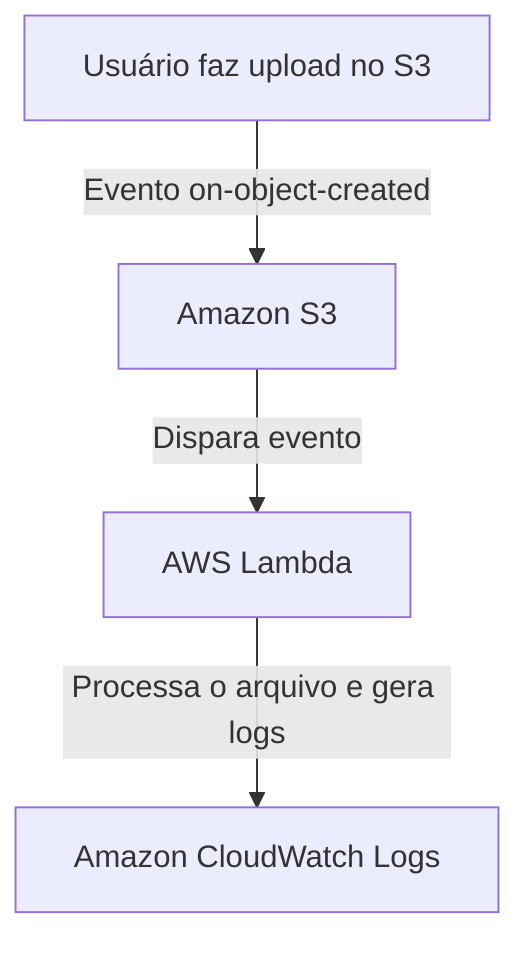
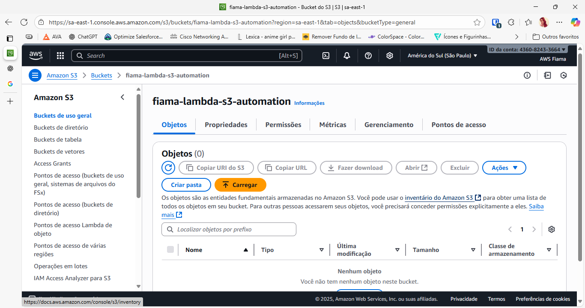
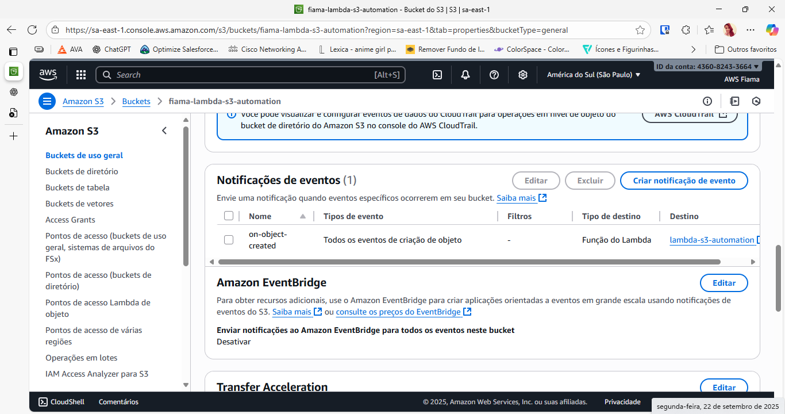
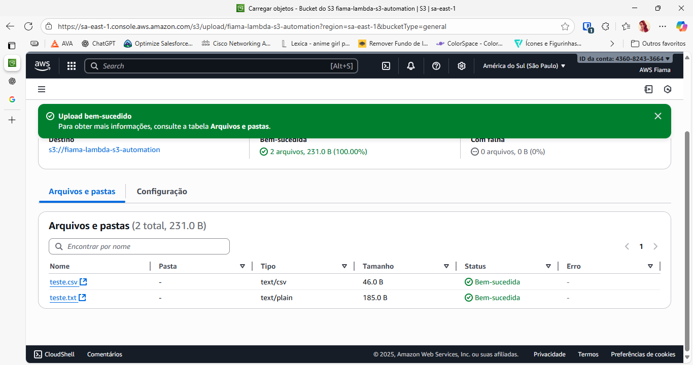
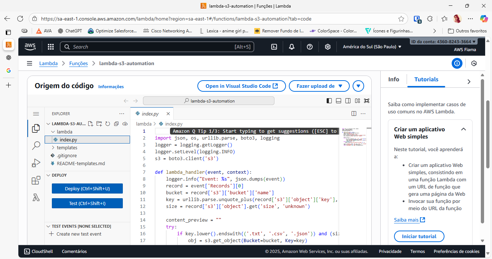
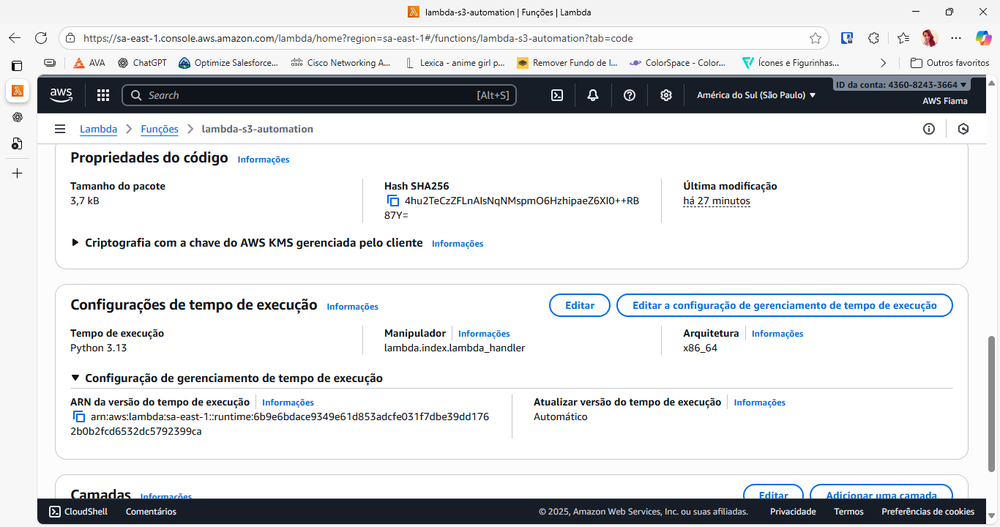
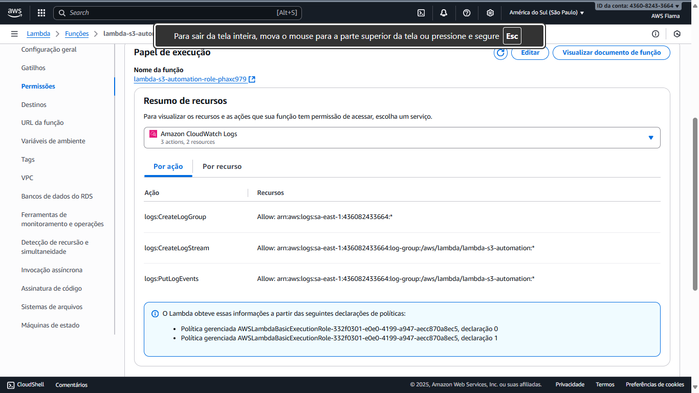
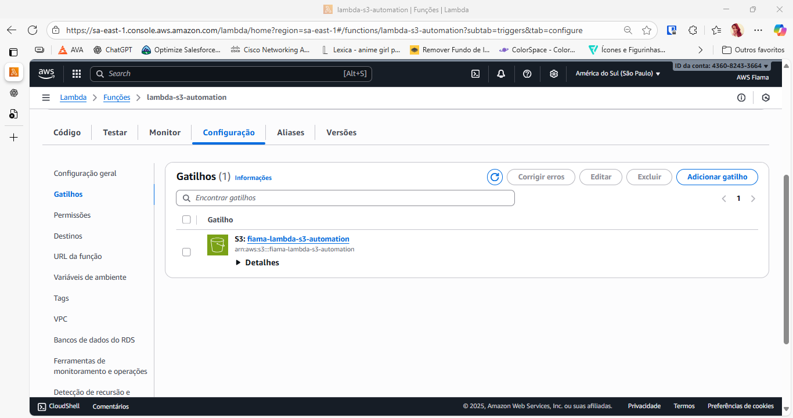
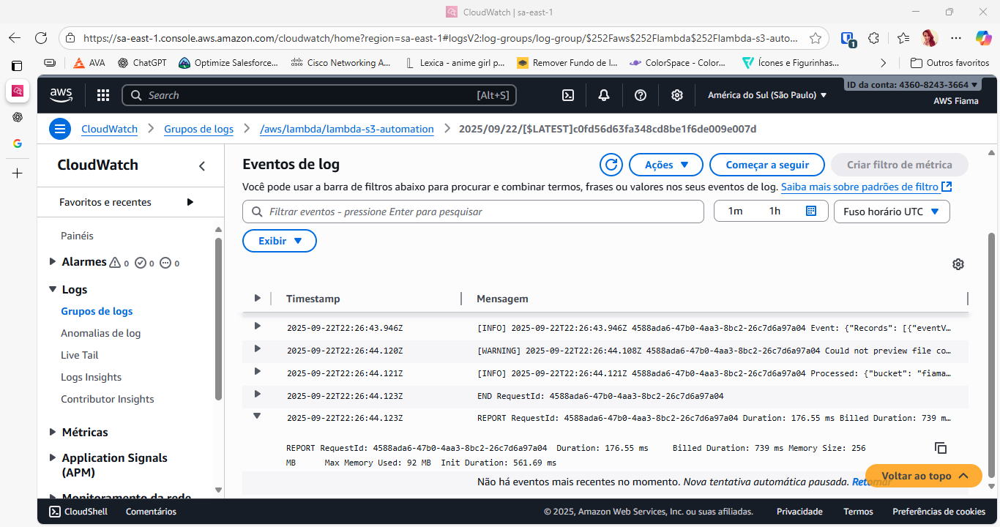

# 🚀 AWS Lambda + S3 Automation

Projeto final do Bootcamp DIO: **Executando Tarefas Automatizadas com AWS Lambda e S3**.  
Este laboratório demonstra a integração entre **Amazon S3**, **AWS Lambda** e **Amazon CloudWatch**, criando um fluxo automatizado para processar arquivos enviados ao bucket.

---

# 🚀 AWS Lambda + S3 Automation


---

## 📖 Descrição

O objetivo é consolidar conhecimentos de **event-driven architecture** na AWS:  
- Criar um bucket S3.  
- Configurar evento para disparar a Lambda em cada upload.  
- Implementar função Lambda em Python para processar os arquivos.  
- Validar logs no CloudWatch.  
- Documentar todo o processo.

---

## 🎯 Objetivos de Aprendizagem

- Aplicar conceitos de computação serverless.  
- Automatizar fluxos com **Lambda + S3**.  
- Documentar configurações e código de forma clara.  
- Utilizar o **GitHub** como portfólio de documentação técnica.  

---

## 🛠️ Arquitetura



---

## 📂 Estrutura do Repositório

```
aws-lambda-s3-automation/
│-- lambda/
│   └─ index.py          # Código da função Lambda
│-- templates/           # Templates auxiliares (opcional)
│-- images/              # Evidências em prints
│   ├─ 01-s3-bucket-list.png
│   ├─ 02-s3-event-notification.png
│   ├─ 03-lambda-code-index.png
│   ├─ 04-lambda-runtime-handler.png
│   ├─ 05-lambda-permissions-role.png
│   ├─ 06-lambda-trigger-s3.png
│   ├─ 07-s3-upload-success.png
│   └─ 08-cloudwatch-log-success.png
│-- README.md            # Documentação principal
```

---

## 💻 Código da Lambda (`index.py`)

```python
import json, os, urllib.parse, boto3, logging

logger = logging.getLogger()
logger.setLevel(logging.INFO)

s3 = boto3.client('s3')

def lambda_handler(event, context):
    logger.info("Event: %s", json.dumps(event))
    record = event['Records'][0]
    bucket = record['s3']['bucket']['name']
    key = urllib.parse.unquote_plus(record['s3']['object']['key'])
    size = record['s3']['object'].get('size', 'unknown')

    content_preview = ""
    try:
        if key.lower().endswith(('.txt', '.csv', '.json')):
            obj = s3.get_object(Bucket=bucket, Key=key)
            body = obj['Body'].read().decode('utf-8')
            content_preview = body[:200]  # primeiros 200 caracteres
    except Exception as e:
        logger.warning("Could not preview file content: %s", str(e))

    result = {
        "bucket": bucket,
        "key": key,
        "size": size,
        "preview": content_preview
    }

    logger.info("Processed: %s", json.dumps(result))
    return result
```

---

## ⚙️ Configurações

- **Bucket S3**: `fiama-lambda-s3-automation`  
- **Evento S3**: `on-object-created` → destino: `lambda-s3-automation`  
- **Lambda Runtime**: Python 3.13  
- **Handler**: `lambda.index.lambda_handler`  
- **Role**: `AWSLambdaBasicExecutionRole` + permissões de leitura no S3  
- **Logs**: registrados automaticamente no **CloudWatch**

---

## 📸 Evidências

### Amazon S3




### AWS Lambda





### CloudWatch


---

## ✅ Checklist de Validação

- [x] Bucket criado no S3.  
- [x] Evento configurado (`on-object-created`).  
- [x] Lambda criada com handler correto (`lambda.index.lambda_handler`).  
- [x] Permissões ajustadas (S3 read + CloudWatch logs).  
- [x] Upload de arquivos `.txt` e `.csv`.  
- [x] Logs confirmados no CloudWatch.  

---

## 📚 Recursos úteis

- [Documentação AWS Lambda](https://docs.aws.amazon.com/lambda/latest/dg/welcome.html)  
- [Documentação Amazon S3](https://docs.aws.amazon.com/s3/index.html)  
- [Amazon CloudWatch Logs](https://docs.aws.amazon.com/AmazonCloudWatch/latest/logs/WhatIsCloudWatchLogs.html)

---

## ✨ Autor

Projeto desenvolvido por **Fiama Ribeiro** 💜  
Bootcamp DIO — *Formação AWS Cloud*
